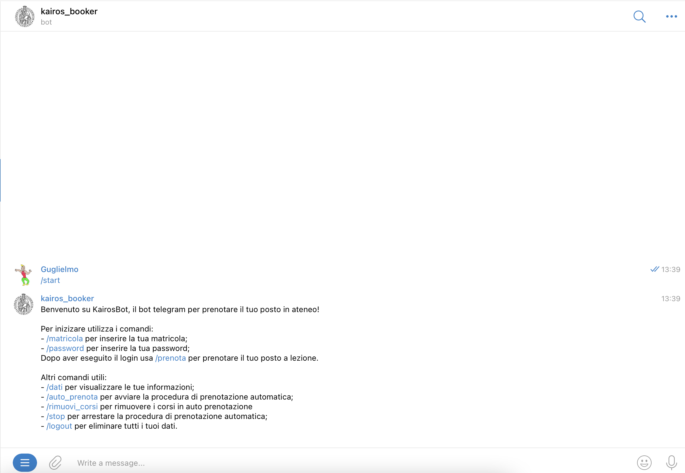

<div id="top"></div>
<!-- PROJECT LOGO -->
<br />
<div align="center">
  <a href="https://github.com/othneildrew/Best-README-Template">
    
  </a>

<h3 align="center">Kairos Booker Bot</h3>

  <p align="center">
Telegram Bot for booking "Università degli Studi di Firenze" lessons automatically based on Spring Boot.

[@kairos_booker_bot](https://t.me/kairos_booker_bot)


[](https://www.gnu.org/licenses/gpl-3.0)
[](https://github.com/Naereen/badges/)
[](https://https://docker.com/)


  </p>
</div>

<!-- ABOUT THE PROJECT -->

## About The Project



This project aims to simplify the process of booking a lesson in Unifi, that is a very slow and boring process,
sometimes you can even forget to book a lesson.
<p align="right">(<a href="#top">back to top</a>)</p>

### Libraries used

- Spring Boot
- Selenium
- Spring Boot Starter Telegram
- Java Telegram Bot Api
- Lombok

<p align="right">(<a href="#top">back to top</a>)</p>

### Roadmap

- [ ] Book study rooms

<p align="right">(<a href="#top">back to top</a>)</p>

## Contributing

Here is how you can contribute to the project

1. Fork the repo
2. Clone the repo
   ```sh
   git clone https://github.com/your_username_/kairos-booker.git
   ```
3. Open the project from your favourite Java IDE (Intellij raccomended)
4. Create a new branch
   ```sh
   git checkout -b mynewbranch
   ```
5. Make some changes
6. Push the changes
7. Make a pull request

<p align="right">(<a href="#top">back to top</a>)</p>


## Contact

- Bartelloni Guglielmo - bartelloni.guglielmo@gmail.com
- Marchini Francesco - francesco.marchini@stud-unifi.it

Project
Link: [https://github.com/guglielmobartelloni/kairos-booker](https://github.com/guglielmobartelloni/kairos-booker)

<p align="right">(<a href="#top">back to top</a>)</p>
